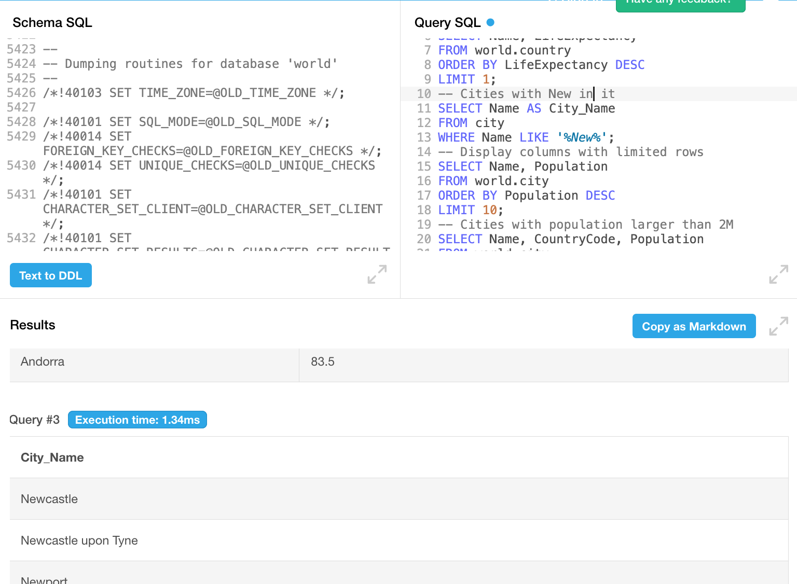
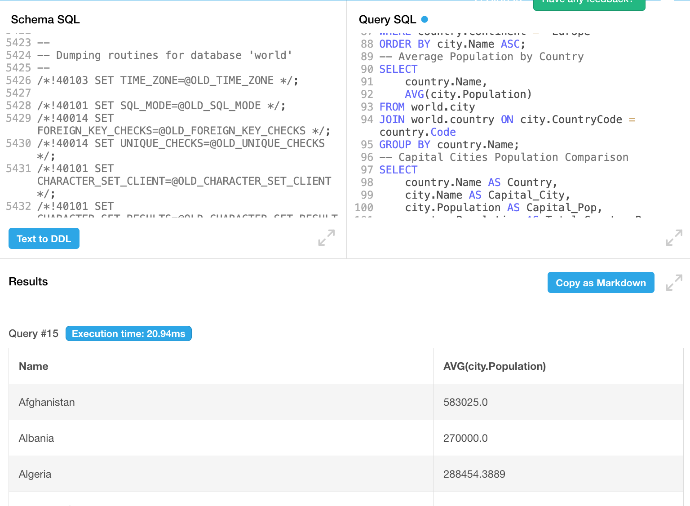
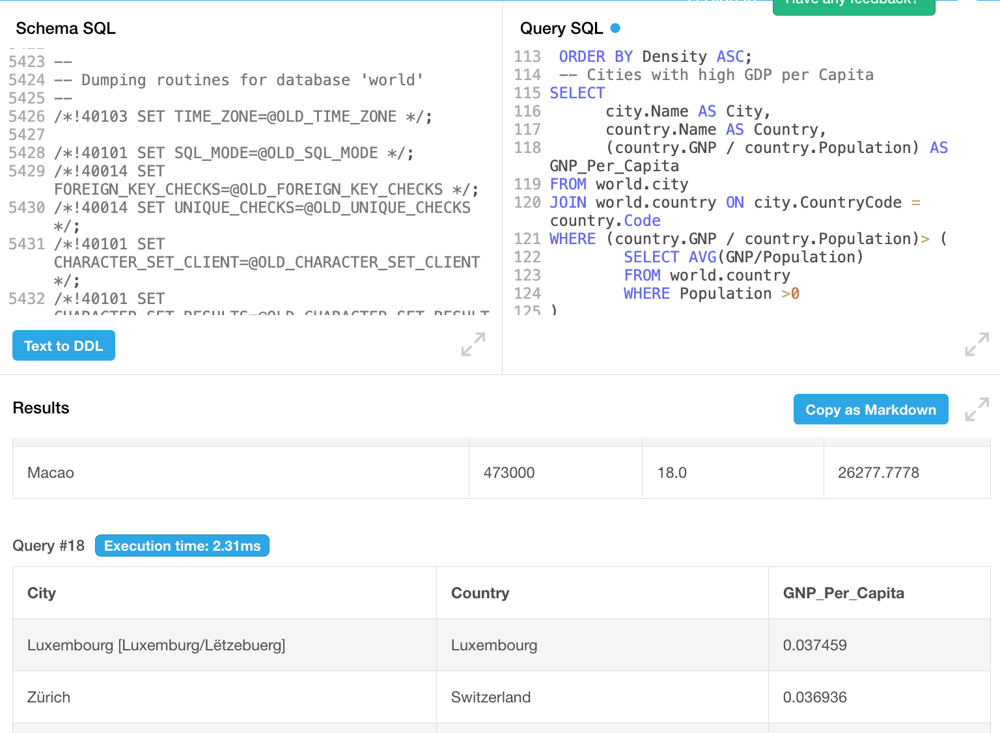

# 
# Case Study: SQL Relational Database Analysis (World Data)

## Project Overview
This project involved the setup and analysis of a comprehensive relational database containing global demographic, geographic, and linguistic data. Using **SQL**, I executed a series of queries to provide actionable insights for various professional scenarios, such as urban planning, health initiatives, and travel promotions.

---

## Situation
As part of the Day 4 curriculum for the **Data Technician** course, I was tasked with a practical SQL exercise. The objective was to implement a "world" database and solve 19 specific data retrieval scenarios ranging from basic counts to complex multi-table joins.

## Task
The primary requirements included:
* **Database Setup:** Successfully implement the world database (City, Country, and CountryLanguage tables).
* **Data Retrieval:** Write and execute SQL syntax to answer 19 business-driven questions.
* **Analysis:** Perform tasks such as identifying life expectancy leaders, urban population counts, and average population metrics.

## Action
### Overcoming Technical Challenges
I initially faced significant hurdles while attempting to install a local SQL environment. To ensure the project stayed on schedule, I **pivoted to a cloud-based SQL environment** to host the database and execute my queries efficiently.

### Schema Implementation
I executed the provided script to build the database architecture, ensuring the following tables were correctly mapped:
* **City:** ID, Name, Population, etc.
* **Country:** Code, Continent, LifeExpectancy, etc.
* **CountryLanguage:** Language, IsOfficial, Percentage.

### Query Development
I authored and tested SQL statements for several key scenarios:
* **Pattern Matching:** Finding cities featuring "New" or starting with the "Be" prefix using `LIKE`.
* **Aggregate Functions:** Utilizing `COUNT(*)` for USA city counts and `AVG(Population)` for regional averages.
* **Joins:** Implementing `INNER JOIN` logic to connect cities with their respective countries to identify European capitals.
* **Advanced Logic:** Completed a bonus challenge to identify cities with an above-average GDP per capita using **subqueries**.

---

## Result
I successfully generated a full demographic report answering all 19 scenarios. Key outcomes included:
* **Longevity Insights:** Identified **Andorra** as the country with the highest life expectancy (**83.5 years**).
* **Market Research:** Compiled a top 10 list of the most populous global cities.
* **Urban Planning:** Provided a filtered list of mid-sized cities (500k–1M population) for infrastructure analysis.
* **Technical Proficiency:** Demonstrated mastery of **referential integrity** (Primary/Foreign Keys) and complex data manipulation.

---

### 📊 Use the Code

[Download the file with the code](Queryfile.sql)

## Screenshots from SQL DB Fiddle

#  

#    

#   

## Database Structure Summary
| Table | Records | Description |
| :--- | :--- | :--- |
| **City** | 4,079 | Global city data and populations. |
| **Country** | 239 | Nations with geographic and economic metrics. |
| **CountryLanguage** | ~1,000 | Official status and language distribution per nation. |
